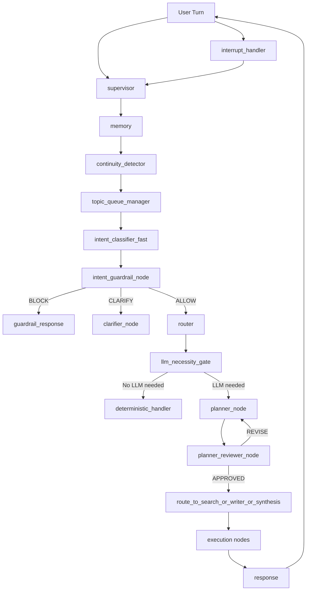

# ScholarFlow Agent Upgrade: Updated Plan + System Architecture

**Date:** 2026-03-17  
**Scope:** Add planning-agent controls before guardrails, integrate NeMo Guardrails, and support interrupt-safe multi-topic handling.

**Compatibility Goal:** Extend (not replace) the current LangGraph orchestration centered on `supervisor`, `memory`, and `router`.

---

## 1) Requested Features (Normalized Requirements)

1. Planning agent
2. Guardrails for intent classifier
3. NeMo Guardrails integration
4. Interrupt handler
5. Reviewer for planner output
6. Queueing between two topics
7. Decide if LLM is needed (via guardrails + policy)
8. Detect whether user input is follow-up vs new starting question

---

## 2) Design Principle: Pre-Guardrail Preprocessing

Before running NeMo Guardrails, the agent should run a **lightweight pre-processing lane** that extracts conversation intent structure and continuity.

In the current ScholarFlow graph, this lane is introduced as **pre-router and supervisor-aware augmentation**:

- `supervisor` remains the orchestration authority.
- `memory` remains the source of conversation context.
- `router` remains the canonical intent router after guardrail normalization.
- Existing specialist routes (`search`, `writer`, `synthesis`, `citation`, etc.) remain intact.

Execution order:

1. **Conversation continuity check** (follow-up vs new question)
2. **Topic queue arbitration** (active topic + queued topic)
3. **Fast intent classification + confidence**
4. **Guardrail policy checks (deterministic + NeMo)**
5. **LLM necessity gate**
6. **Planner + planner reviewer loop**
7. **Execution agents (search/writer/etc.)**

This order avoids sending unnecessary turns to heavy guardrail/LLM calls and improves latency.

---

## 3) Updated Logical Architecture

### 3.1 New/Extended Components

- **A. Continuity Detector (new node/service)**
  - Classifies incoming turn as:
    - `FOLLOW_UP_SAME_TOPIC`
    - `FOLLOW_UP_TOPIC_SHIFT`
    - `NEW_QUESTION`
  - Inputs: latest user message + last N turns + active topic metadata.
  - Output stored in state for routing.

- **B. Topic Queue Manager (new stateful utility)**
  - Maintains max 2 active topic lanes:
    - `active_topic`
    - `queued_topic`
  - Handles transitions:
    - interrupt to queued topic
    - resume previous topic
    - drop stale queued topic on timeout/user clear

- **C. Intent Classifier Guardrails (new policy layer)**
  - Wraps current intent classification with:
    - deterministic rules (regex/keyword/domain constraints)
    - confidence thresholds
    - NeMo guardrail checks for unsafe/unsupported operations
  - Produces `intent_decision` with `decision_source` and confidence.

- **D. LLM Necessity Gate (new gate node)**
  - Decides if request needs model invocation.
  - `needs_llm = false` for deterministic responses (help text, command routing, context switch acknowledgments, queue state responses).
  - `needs_llm = true` for planning, synthesis, drafting, nuanced reasoning.

- **E. Planner Reviewer (new node)**
  - Reviews planner output for:
    - completeness
    - safety/policy compliance
    - executability by downstream nodes
  - Can request planner revision with structured feedback.

- **F. Interrupt Handler (new orchestration node)**
  - Captures explicit/implicit user interrupts ("stop", "wait", topic pivot).
  - Persists current work state and pushes/resumes topic queue.
  - Ensures safe cancellation and resumability.

### 3.2 Existing Components Reused

- `backend/app/agents/specialists.py` (existing supervisor/memory agents remain primary coordinators)
- `backend/app/agents/graph.py` for node wiring/conditional routes
- `backend/app/agents/state.py` for shared `ResearchState`
- `backend/app/agents/routing.py` for route decisions
- `backend/app/agents/message_bus.py` for topic-level event propagation
- `backend/app/services/query_analyzer.py` for deeper query understanding when needed

### 3.3 Supervisor-Centric Integration Contract

To align with the current system architecture, the new nodes are inserted with minimal disruption:

1. `supervisor` executes first for orchestration and safety context setup.
2. `memory` enriches state with recent turns and topic traces.
3. `continuity_detector` and `topic_queue_manager` annotate state (no direct specialist routing yet).
4. `intent_classifier_fast` + `intent_guardrail_node` produce guarded intent.
5. `router` consumes `intent_guarded` as the final normalized signal.
6. Existing downstream graph behavior executes as today, with optional planner-review loop when selected.

This keeps control with `supervisor` and preserves current routing semantics while adding guardrail-aware intelligence.

---

## 4) State Model Changes (ResearchState Additions)

Add these fields in `backend/app/agents/state.py`:

```python
# Continuity + topic management
continuity_type: Optional[str]          # FOLLOW_UP_SAME_TOPIC | FOLLOW_UP_TOPIC_SHIFT | NEW_QUESTION
continuity_confidence: Optional[float]
active_topic_id: Optional[str]
active_topic_label: Optional[str]
queued_topic_id: Optional[str]
queued_topic_label: Optional[str]
topic_queue_reason: Optional[str]

# Intent guardrail outputs
intent_raw: Optional[str]
intent_guarded: Optional[str]
intent_confidence: Optional[float]
intent_guardrail_status: Optional[str]  # ALLOW | BLOCK | CLARIFY
intent_guardrail_reason: Optional[str]
decision_source: Optional[str]          # RULE | NEMO | LLM

# LLM gate
needs_llm: Optional[bool]
llm_gate_reason: Optional[str]

# Planning review + interrupts
planner_review_status: Optional[str]    # APPROVED | REVISE
planner_review_feedback: Optional[str]
interrupted: bool
interrupt_reason: Optional[str]
resume_token: Optional[str]
```

---

## 5) Updated Graph Flow

### 5.1 High-level sequence



### 5.2 Routing contracts

- `supervisor` keeps top-level authority and decides whether to continue normal flow or trigger interrupt recovery.
- `memory` enriches context for continuity, queueing, and intent normalization.
- `intent_guardrail_node` returns one of:
  - `guardrail_response`
  - `clarifier`
  - `router`
- `router` remains the canonical dispatcher, but now reads `intent_guarded` when available (fallback: existing `intent`).
- `llm_necessity_gate` returns one of:
  - `deterministic_handler`
  - `planner`
- `planner_reviewer_node` returns one of:
  - `planner` (revise loop)
  - downstream route from planner intent

---

## 6) NeMo Guardrails Integration Plan

### 6.1 Guardrail categories

1. **Intent safety constraints**
   - Block unsupported/harmful intent categories
2. **Domain constraints**
   - Enforce academic assistant boundaries
3. **Conversation policy checks**
   - Detect unsafe prompt instructions before planner execution
4. **Fallback policy**
   - If NeMo unavailable/timeouts, fallback to deterministic safe defaults (`CLARIFY` or safe refusal)

### 6.2 Integration points

- New service wrapper: `backend/app/services/guardrails_service.py`
  - `check_intent_guardrails(context) -> GuardrailDecision`
  - `check_input_guardrails(context) -> GuardrailDecision`
- Node integration in graph:
  - `intent_guardrail_node` calls `guardrails_service`
  - emits structured status into state and logs

---

## 7) Interrupt + Two-Topic Queue Behavior

### 7.1 Supported user behaviors

- User interrupts ongoing planning/execution with a new question.
- System stores interrupted topic as queued or active based on recency and explicit user intent.
- Only two slots maintained for predictability.

### 7.2 Queue policy

- If active topic exists and new turn is unrelated:
  - move active to `queued_topic`
  - set new topic as `active_topic`
- If queue already occupied:
  - replace queued only when confidence for new topic is higher or user explicitly requests switch
- If user says "continue previous":
  - swap active/queued and resume by `resume_token`

---

## 8) Planner + Reviewer Contract

Planner output should be strict JSON (or schema-validated dict) with:

- `goal`
- `steps[]`
- `required_tools[]`
- `success_criteria[]`
- `safety_notes[]`

Reviewer checks:

- missing or circular steps
- unsafe/unbounded actions
- mismatch between intent and execution plan
- insufficient evidence requirements (for research mode)

---

## 9) Phased Implementation Plan

### Phase 1 — State + Routing Foundation

Files:
- `backend/app/agents/state.py`
- `backend/app/agents/graph.py`
- `backend/app/agents/routing.py`

Deliverables:
- Add continuity/topic/guardrail/interrupt fields
- Add placeholder nodes and conditional routes integrated with `supervisor -> memory -> router`
- Keep existing behavior as fallback

### Phase 2 — Continuity + Topic Queue + Interrupt Handler

Files:
- `backend/app/agents/nodes.py` (or split into `nodes/continuity.py`, `nodes/interrupt.py`)
- `backend/app/agents/message_bus.py`

Deliverables:
- Implement follow-up vs new-question detector
- Implement 2-topic queue transitions
- Implement interrupt-safe pause/resume state updates

### Phase 3 — Guardrails + LLM Necessity Gate

Files:
- `backend/app/services/guardrails_service.py` (new)
- `backend/app/agents/nodes.py`
- `backend/app/core/config.py` (guardrail toggles/timeouts)

Deliverables:
- Integrate NeMo guardrail checks
- Deterministic fallback policies
- Add `llm_necessity_gate` node and route mapping without bypassing supervisor/router contracts

### Phase 4 — Planner Reviewer Loop

Files:
- `backend/app/agents/graph.py`
- `backend/app/agents/nodes.py`

Deliverables:
- Add `planner_reviewer_node`
- Enforce revise/approve loop with max iteration bound

### Phase 5 — Telemetry + QA Hardening

Files:
- `backend/app/agents/workflow_monitor.py`
- `backend/app/api/*` (SSE payload extensions)
- `tests/*`

Deliverables:
- Add metrics (guardrail blocks, LLM skip rate, interrupt/resume success)
- Add unit/integration tests for queue and continuity routing

---

## 10) Acceptance Criteria

1. Follow-up detector correctly classifies 3 continuity types with target accuracy threshold (define in test set).
2. Two-topic queue behavior is deterministic and tested for switch/resume/replace.
3. Guardrail node can return `ALLOW`, `BLOCK`, `CLARIFY` and routes correctly.
4. `needs_llm=false` path avoids model invocation and returns valid deterministic response.
5. Planner reviewer catches malformed plans and forces revision.
6. Interrupt during planner or execution preserves resumable state without corruption.
7. Existing `supervisor -> memory -> router` flow remains functional when new features are disabled.
8. Existing specialist routing outcomes remain unchanged for baseline scenarios.

---

## 11) Risks and Mitigations

- **Risk:** Guardrail latency increases response time.  
  **Mitigation:** deterministic pre-checks first, NeMo timeout + fallback.

- **Risk:** Over-blocking benign intents.  
  **Mitigation:** `CLARIFY` path before `BLOCK` where possible + policy tuning logs.

- **Risk:** Topic queue confusion for users.  
  **Mitigation:** explicit user-facing queue state messages and resume prompts.

- **Risk:** Planner-review loops become expensive.  
  **Mitigation:** max review iterations and concise schema validation.

---

## 12) Immediate Next Build Tasks (Recommended Order)

1. Add new fields to `ResearchState` and default initializers.
2. Add no-op nodes in graph: `continuity_detector`, `topic_queue_manager`, `intent_guardrail_node`, `llm_necessity_gate`, `interrupt_handler`, `planner_reviewer_node`.
3. Wire conditional routes with safe fallback to current flow.
4. Implement deterministic continuity + queue logic.
5. Integrate NeMo guardrails behind feature flag.
6. Add tests for routing and queue transitions.
