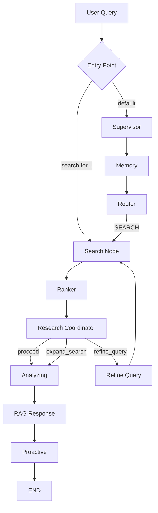
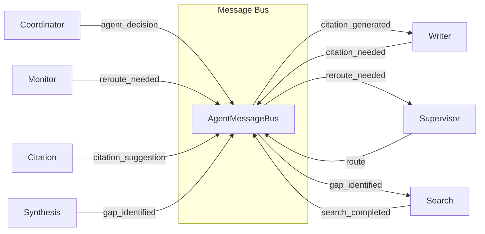

# ScholarFlow — Deep Technical Analysis

> **ScholarFlow** is an AI-powered academic research assistant that uses a **LangGraph multi-agent system** to help researchers discover papers, synthesize insights, and draft scholarly manuscripts — all through a conversational interface backed by an interactive AI avatar.

---

## Table of Contents

- [1. Project Overview](#1-project-overview)
- [2. What Can ScholarFlow Do?](#2-what-can-scholarflow-do)
- [3. Technology Stack](#3-technology-stack)
- [4. Architecture Overview](#4-architecture-overview)
- [5. LangGraph Agentic AI System — Full Analysis](#5-langgraph-agentic-ai-system--full-analysis)
  - [5.1 Shared State (ResearchState)](#51-shared-state-researchstate)
  - [5.2 The Non-Linear Multi-Agent Graph](#52-the-non-linear-multi-agent-graph)
  - [5.3 Core Workflow Nodes](#53-core-workflow-nodes)
  - [5.4 Specialist Agents](#54-specialist-agents)
  - [5.5 Dynamic Routing System](#55-dynamic-routing-system)
  - [5.6 Agent Message Bus](#56-agent-message-bus)
  - [5.7 Performance & Optimization Layer](#57-performance--optimization-layer)
  - [5.8 Workflow Monitor](#58-workflow-monitor)
- [6. RAG Grounding System](#6-rag-grounding-system)
- [7. Vector Store & Embeddings](#7-vector-store--embeddings)
- [8. Frontend Architecture](#8-frontend-architecture)
- [9. API Layer](#9-api-layer)
- [10. Data Model](#10-data-model)
- [11. Graph Flow Diagrams](#11-graph-flow-diagrams)

---

## 1. Project Overview

**ScholarFlow** is a full-stack AI research assistant designed for **students, researchers, and academics**. It bridges the gap between discovering relevant research literature and producing well-cited academic manuscripts. The system utilizes **custom-trained Ollama models** (fine-tuned on arXiv papers) as its primary intelligence engine, acting as an **AI co-author**. It can search for papers across ArXiv and Semantic Scholar, analyze and rank them for relevance, synthesize insights, and draft publication-quality academic text with proper citations.

What makes ScholarFlow unique is its use of **LangGraph** to orchestrate a **non-linear multi-agent workflow** where specialized AI agents (Supervisor, Search, Ranker, Writer, Reviewer, Citation, Synthesis, etc.) collaborate dynamically, routing tasks to each other based on real-time context rather than following a rigid pipeline.

---

## 2. What Can ScholarFlow Do?

| Capability | Description |
|---|---|
| **Paper Discovery** | Search ArXiv & Semantic Scholar with AI-optimized queries; auto-refine if results are poor |
| **Intelligent Ranking** | Batch-score papers for relevance using LLM; iterative refinement loop |
| **RAG-Grounded Q&A** | Answer research questions grounded in actual papers with inline citations `[1]`, `[2]` |
| **Academic Drafting** | Generate section-aware manuscripts (Introduction, Methods, Results, Discussion, Conclusion) |
| **Manuscript Outline** | AI-generated outlines with parallel section drafting |
| **Draft Review Loop** | Automated reviewer agent critiques drafts; writer revises iteratively |
| **Citation Management** | IEEE/APA citation formatting, bibliography generation, citation gap detection |
| **Multi-Paper Synthesis** | Cross-paper comparison, contradiction identification, gap analysis |
| **Lab Asset Analysis** | Gemini Vision analysis of experimental figures, data, and images |
| **PDF Processing** | Upload PDFs → chunk with page tracking → index in FAISS vector store |
| **AI Avatar** | Interactive AI avatar with voice (TTS via Edge-TTS, STT via Faster-Whisper) |
| **Project Management** | Multiple research projects with file systems, paper libraries, and research assets |
| **Chat Memory** | Conversation history indexed in vector store for long-term context retrieval |
| **Real-time Streaming** | Server-Sent Events (SSE) stream agent progress and responses to the UI |

---

## 3. Technology Stack

### Backend

| Technology | Purpose |
|---|---|
| **Python 3.10+** | Core language |
| **FastAPI** | REST API framework with async support |
| **LangGraph ≥ 0.2.45** | Multi-agent workflow orchestration (StateGraph with cyclic graphs) |
| **LangChain ≥ 0.3.0** | LLM abstraction layer (core, community, Google GenAI, Ollama) |
| **Ollama (Custom Models)** | **Primary LLM Engine**. Uses custom models trained on arXiv papers (`scholarflow-search`, `scholarflow-studio`, `scholarmate`, etc.) for highly specialized academic tasks. |
| **Google Gemini** | Fallback LLM and Vision Analysis (via `gemini-1.5-flash`) specifically for processing lab assets and visual data. |
| **FAISS** | Vector similarity search for RAG |
| **Sentence-Transformers** | Embedding model (`all-MiniLM-L6-v2`, 384-dim) |
| **SQLAlchemy + Alembic** | ORM and database migrations (SQLite) |
| **ArXiv API** | Academic paper search |
| **Semantic Scholar API** | Academic paper search |
| **PyMuPDF + pdfplumber** | PDF text extraction with page tracking |
| **Edge-TTS** | Text-to-speech for avatar |
| **Faster-Whisper** | Speech-to-text for voice input |
| **Pydantic v2** | Data validation and settings management |

### Frontend

| Technology | Purpose |
|---|---|
| **React 19** | UI framework |
| **TypeScript** | Type-safe JavaScript |
| **Vite 6** | Build tool and dev server |
| **Zustand 5** | State management (stores: `appStore`, `projectStore`, `agentStore`, `toastStore`) |
| **TanStack React Query** | API data fetching and caching |
| **Monaco Editor** | Code/text editor (Overleaf-like file editing) |
| **Lucide React** | Icon library |
| **react-markdown** | Markdown rendering for AI responses |
| **react-pdf / pdfjs-dist** | PDF viewer |
| **Anam.ai SDK** | Interactive AI avatar |
| **Axios** | HTTP client |

---

## 4. Architecture Overview

```
┌─────────────────────────────────────────────────────────────┐
│                     FRONTEND (React + Vite)                 │
│                                                             │
│  Dashboard → WorkspaceDiscovery → WorkspaceReading          │
│                    ↕                    ↕                    │
│              WorkspaceStudio ← AgentPanel + Avatar          │
│                                                             │
│  Stores: appStore | projectStore | agentStore | toastStore   │
│  Hooks:  useStreaming | useProjects | useLabAssets           │
└──────────────────────────┬──────────────────────────────────┘
                           │ REST + SSE
┌──────────────────────────▼──────────────────────────────────┐
│                 BACKEND (FastAPI + LangGraph)                │
│                                                             │
│  API Routes:  /chat  /research  /papers  /projects          │
│               /lab   /agents    /voice   /avatar            │
│                                                             │
│  ┌───────────────────────────────────────────────────────┐  │
│  │            LANGGRAPH MULTI-AGENT SYSTEM               │  │
│  │                                                       │  │
│  │  Supervisor → Memory → Router                         │  │
│  │       ↓                   ↓                           │  │
│  │  [Search ↔ Ranker ↔ Coordinator ↔ Refiner]           │  │
│  │       ↓                                               │  │
│  │  [Analyzing → RAG Response → Proactive → END]         │  │
│  │       ↓                                               │  │
│  │  [Planner → Writer ↔ Reviewer ↔ Citation]            │  │
│  │       ↓                                               │  │
│  │  [Synthesis ↔ Proactive → END]                        │  │
│  │                                                       │  │
│  │  + Message Bus + Workflow Monitor + Performance Cache  │  │
│  └───────────────────────────────────────────────────────┘  │
│                                                             │
│  Services: VectorStore | RAGGrounding | PaperSearch          │
│            ArxivClient | SemanticScholar | PDFProcessor      │
│            QueryAnalyzer | AnswerGenerator | VoiceService    │
│                                                             │
│  Core: AIClient (Custom Ollama + Gemini) | Config | Database│
└─────────────────────────────────────────────────────────────┘
```

---

## 5. LangGraph Agentic AI System — Full Analysis

The heart of ScholarFlow is a **LangGraph `StateGraph`** that implements a **non-linear, multi-agent research workflow**. Unlike simple sequential chains, this graph supports **cyclic edges, conditional routing, and dynamic agent-to-agent communication**.

### 5.1 Shared State (`ResearchState`)

> **File:** `backend/app/agents/state.py`

All agents operate on a shared `ResearchState` TypedDict that flows through every node. It contains **40+ fields** organized into categories:

```python
class ResearchState(TypedDict):
    # Core conversation
    messages: Annotated[List[BaseMessage], operator.add]  # Append-only message log
    query: str                                            # User's research question
    project_id: str                                       # Active project
    session_id: Optional[str]                             # Chat session

    # Discovery workflow
    found_papers: List[Dict]          # Raw search results
    ranked_papers: List[Dict]         # After relevance scoring
    selected_paper_ids: List[str]     # User-selected context papers
    search_iteration: int             # Refinement loop counter
    refined_query: Optional[str]      # Modified query for retry

    # Drafting workflow
    current_draft: Dict               # {section, content, status}
    current_section: Optional[str]    # Active section being drafted
    critique_feedback: Optional[str]  # From reviewer agent
    revision_count: int               # Revision loop counter
    needs_revision: bool              # Conditional edge flag

    # Intent routing
    intent: Optional[str]             # "SEARCH" | "CHAT" | "DRAFT" | "ANALYZE"
    operation_mode: Optional[str]     # "research" | "studio"

    # Coordinator intelligence
    coordinator_decision: Optional[str]   # "proceed" | "refine_query" | "expand_search"
    coordinator_reasoning: Optional[str]  # Why this decision
    coordinator_suggestions: Optional[str]

    # Multi-agent extensions
    active_agent: Optional[str]
    agent_history: Annotated[List[Dict], operator.add]  # Agent handoff log
    supervisor_decision: Optional[Dict]

    # Non-linear workflow extensions
    agent_messages: Annotated[List[Dict], operator.add]  # Inter-agent messages
    workflow_state: Optional[str]     # "running" | "paused" | "complete" | "stuck"
    routing_history: Annotated[List[Dict], operator.add]
    reroute_requested: bool           # Dynamic re-routing flag
    # ... citations, bibliography, synthesis, memory, quality feedback, etc.
```

Key design decisions:
- **`Annotated[List, operator.add]`** — Fields like `messages`, `logs`, `agent_history` use `operator.add` so each node appends rather than replaces, enabling incremental state accumulation.
- **`create_initial_state()` factory** — Safely initializes all 40+ fields with sensible defaults.

---

### 5.2 The Non-Linear Multi-Agent Graph

> **File:** `backend/app/agents/graph.py`

The graph is constructed in `create_research_graph()` and compiled into a singleton `research_graph`. It contains **18 nodes** and uses **conditional edges** to enable dynamic, non-linear routing.

#### Node Inventory

| Node | Type | Purpose |
|---|---|---|
| `supervisor` | Orchestration | Routes requests to appropriate agent, monitors progress |
| `memory` | Orchestration | Manages conversation history and context retrieval |
| `monitor` | Orchestration | Detects stuck states, suggests re-routing |
| `router` | Orchestration | Classifies intent (SEARCH/DRAFT/ANALYZE/CHAT) |
| `clarifier` | Query | Checks query ambiguity, asks clarifying questions |
| `search` | Discovery | Searches ArXiv + Semantic Scholar with optimized queries |
| `ranker` | Discovery | Batch-scores papers for relevance using LLM |
| `research_coordinator` | Discovery | Intelligent agent evaluating search quality and strategy |
| `refine_query` | Discovery | Refines search query based on coordinator guidance |
| `save_to_context` | Discovery | Saves ranked papers to database |
| `analyzing` | Response | Shows "thinking" status to user (SSE) |
| `rag_response` | Response | Generates RAG-grounded response with citations |
| `planner` | Drafting | Generates manuscript outline |
| `writer` | Drafting | Section-aware academic writing with context blending |
| `reviewer` | Drafting | Critiques drafts, flags revision needs |
| `reviewer_approved` | Drafting | Finalizes approved drafts |
| `citation` | Specialized | Citation management, bibliography, gap detection |
| `proactive` | Specialized | Suggests next actions, analyzes draft quality |
| `synthesis` | Specialized | Multi-paper synthesis and comparative analysis |
| `validator` | Utility | Validates citation accuracy |
| `build_bibliography` | Utility | Generates formatted bibliography |

#### Conditional Entry Point

The graph uses `set_conditional_entry_point()` to dynamically choose the starting node based on query analysis — bypassing orchestration overhead for simple requests:

```python
# Direct entry for simple tasks (skip supervisor/memory/router)
"search for papers" → Entry: search
"write a draft"     → Entry: writer
"cite this paper"   → Entry: citation
"compare papers"    → Entry: synthesis
default             → Entry: supervisor (full orchestration)
```

---

### 5.3 Core Workflow Nodes

> **File:** `backend/app/agents/nodes.py` (1,233 lines)

#### Router Node
Uses **fast keyword-based classification** (no LLM call) to determine intent:
- `"draft"`, `"write"` → `DRAFT`
- `"analyze"` + `"image"/"data"` → `ANALYZE`
- Everything else → `SEARCH` (default for research queries)

#### Search Node
1. Analyzes the query via `QueryAnalyzer` service (generates optimized search terms)
2. Searches all sources via `search_all_sources()` (ArXiv + Semantic Scholar)
3. If < 3 results, tries expanded queries from the analyzer
4. Deduplicates and limits to 10 papers
5. **Auto-saves** discovered papers to the project library

#### Ranker Node (Optimized)
Uses **batch scoring** — sends all papers to the LLM in a single prompt:
```
Rate the relevance of these N papers to the query (0.0 to 1.0).
Return ONLY comma-separated scores: "0.85, 0.72, 0.91, ..."
```
This is **10× faster** than scoring papers individually. Falls back to individual scoring if batch parsing fails.

#### Research Coordinator Node
An **intelligent agent** that evaluates search results and decides strategy:
- `"proceed"` → Results are good, move to analysis
- `"refine_query"` → Query is too broad/narrow
- `"expand_search"` → Need more papers
- `"try_different_approach"` → Current strategy isn't working

Provides **reasoning** for all decisions (transparent decision-making).

#### Writer Node (Section-Aware)
Supports two modes:
1. **Parallel Manuscript Drafting** — When an outline exists, generates all sections in parallel via `ai_client.generate_batch()`
2. **Single Section Drafting** — Context-aware generation with:
   - **Literature context** from FAISS vector store (selected papers)
   - **Research context** from student's own research assets
   - **Section-aware weighting** (e.g., Introduction = 80% literature / 20% research; Results = 80% research / 20% literature)

#### Reviewer Node
Critiques drafts and sets `needs_revision` flag, triggering the **Review Loop** (writer ↔ reviewer cycle, max 2 iterations).

#### RAG Response Node
Calls `generate_grounded_response()` which:
1. Formats papers into context with citation mapping `[1]`, `[2]`
2. Generates **dual output**: conversational narration (for avatar) + formal content (for display)
3. Appends reference list
4. Extracts which papers were actually cited

---

### 5.4 Specialist Agents

> **File:** `backend/app/agents/specialists.py`

Six specialized agent classes, managed as singletons:

| Agent | Class | Responsibility |
|---|---|---|
| **SupervisorAgent** | Coordinates workflow, decides which agent handles a task, monitors progress |
| **MemoryAgent** | Conversation history, context retrieval, history compression |
| **CitationAgent** | Citation generation (IEEE/APA), bibliography, citation gap detection |
| **ResearchCoordinatorAgent** | Search strategy, query refinement, coverage assessment |
| **ProactiveAgent** | Suggests next actions, analyzes draft quality |
| **SynthesisAgent** | Multi-paper synthesis, comparative analysis, contradiction detection |

#### CitationAgent
- Supports **IEEE** and **APA** citation styles
- Maintains a `citation_map` (paper_id → citation_number)
- Subscribes to `CITATION_NEEDED` messages via the message bus
- Can generate full bibliography and suggest where citations are missing

#### ResearchCoordinatorAgent
Acts as an **intelligent co-author** guiding the research process:
- Evaluates search quality metrics (total papers, relevant papers, avg score)
- Decides whether to proceed, refine query, expand search, or try different approach
- Provides human-readable reasoning for all decisions
- Publishes decisions to the message bus

---

### 5.5 Dynamic Routing System

> **File:** `backend/app/agents/routing.py`

The routing system enables **non-linear, context-aware transitions** between agents. Each routing function examines the current state and decides the next agent:

```
route_from_writer:    → citation | search | synthesis | reviewer | writer
route_from_search:    → ranker | synthesis | writer
route_from_synthesis: → search | writer | citation | proactive
route_from_citation:  → writer | validator | bibliography
route_from_reviewer:  → writer | planner | citation | proactive
route_from_planner:   → writer | search | synthesis
route_from_proactive: → search | synthesis | writer | END
route_from_ranker:    → refine_query | save_to_context | synthesis | rag_response
```

**Key routing intelligence:**
- **Writer** detects content markers (`[CITE]`, `TODO:`, `[SYNTHESIZE]`) to dynamically hand off to other agents
- **Synthesis** detects contradictions/gaps in papers and triggers new searches
- **Reviewer** distinguishes structural issues (→ planner) from content issues (→ writer) from citation issues (→ citation)
- **Proactive** only takes action on high-priority suggestions; otherwise ends the workflow

---

### 5.6 Agent Message Bus

> **File:** `backend/app/agents/message_bus.py`

A **publish-subscribe message bus** enabling direct agent-to-agent communication outside the graph edges:

```python
class AgentMessageBus:
    publish(from_agent, topic, payload, to_agent?, priority?)
    subscribe(topic, callback)
    send_to_agent(from_agent, to_agent, topic, payload) → response
    get_messages(for_agent?, topic?, since?, unprocessed_only?)
```

**Standard Message Topics:**

| Category | Topics |
|---|---|
| Search | `new_paper_found`, `search_completed`, `search_failed` |
| Citation | `citation_needed`, `citation_generated`, `citation_suggestion` |
| Writing | `draft_started`, `draft_updated`, `draft_completed`, `knowledge_gap` |
| Synthesis | `synthesis_completed`, `contradiction_found`, `gap_identified` |
| Review | `review_completed`, `revision_needed`, `quality_issue` |
| Workflow | `workflow_paused`, `workflow_resumed`, `agent_stuck`, `reroute_needed` |

Features **priority levels** (LOW, MEDIUM, HIGH, URGENT) and **async-safe locking**.

---

### 5.7 Performance & Optimization Layer

> **File:** `backend/app/agents/performance.py`

| Optimization | How It Works |
|---|---|
| **Response Cache** | LRU cache for synthesis results, routing decisions |
| **Fast Path** | Simple queries (cite, search, show) skip orchestration entirely |
| **Batch Scoring** | All papers ranked in one LLM call instead of N calls |
| **Parallel Execution** | `asyncio.gather()` for independent agent tasks |
| **Pre-computed Paths** | Direct agent-to-agent paths cached (e.g., writer→citation) |
| **Performance Tracker** | Monitors agent execution times, flags slow agents (>5s) |
| **Streaming** | Token-by-token response streaming via SSE |

---

### 5.8 Workflow Monitor

> **File:** `backend/app/agents/workflow_monitor.py`

Detects and recovers from stuck workflows:
- **Stuck detection**: No checkpoint for 30+ seconds, OR same agent ran 5+ consecutive times
- **Reroute suggestions**: Context-aware alternative agents (e.g., stuck writer → search for new insights)
- **Performance analysis**: Tracks agent durations, identifies bottlenecks (>10s average)
- **Progress summary**: Human-readable workflow path visualization

---

## 6. RAG Grounding System

> **File:** `backend/app/services/rag_grounding.py`

All research responses are **grounded in actual found papers** to prevent hallucination:

1. **Context Formatting**: Papers are formatted with numbered citations `[1]`, `[2]`... including title, authors, year, and abstract/content
2. **Dual Output Prompt**: The LLM generates two outputs:
   - **NARRATION** — Conversational explanation (for the AI avatar to speak)
   - **CONTENT** — Formal academic synthesis (for display in the UI)
3. **Citation Tracking**: Extracts which `[N]` citations were actually used in the response
4. **Chain-of-Thought**: Optional `<thinking>` tag parsing for transparent reasoning
5. **Reference List**: Auto-appended formatted reference list with page numbers and URLs
6. **Streaming**: `stream_grounded_response()` yields token-by-token for real-time display

---

## 7. Vector Store & Embeddings

> **File:** `backend/app/services/vector_store.py`

| Feature | Implementation |
|---|---|
| **Engine** | FAISS (`IndexFlatL2`) — exact L2 distance search |
| **Embeddings** | `all-MiniLM-L6-v2` (384 dimensions) via Sentence-Transformers |
| **Indexing** | Per-project indexes stored as `.index` + `_metadata.npy` files |
| **Page Tracking** | `add_document_chunks_with_pages()` stores page numbers for PDF-to-page linking |
| **Chat Memory** | `add_chat_interaction()` indexes Q&A pairs for long-term context |
| **Filtering** | Search results filterable by paper IDs and content type (paper vs. chat) |

---

## 8. Frontend Architecture

### Core Components

| Component | Purpose |
|---|---|
| `App.tsx` | Root component with workspace management, mode switching, panel layout |
| `Dashboard.tsx` | Project listing, creation, and management |
| `WorkspaceDiscovery.tsx` | Chat-based paper discovery with SSE streaming |
| `WorkspaceReading.tsx` | PDF viewer with annotation |
| `WorkspaceStudio.tsx` | Overleaf-like editor with file tree, outline, drafting |
| `SidebarLeft.tsx` | Navigation, paper library, file tree |
| `SidebarRight.tsx` | Agent panel, chat, settings |
| `AgentPanel.tsx` | Agent activity log, streaming responses |
| `AgentAvatar.tsx` | Animated AI avatar with Anam.ai integration |

### State Management (Zustand)

| Store | Manages |
|---|---|
| `appStore` | View state, active mode, sidebar visibility |
| `projectStore` | Active project data, files, papers, outline, word count |
| `agentStore` | Agent state (IDLE/LISTENING/THINKING/SPEAKING), logs |
| `toastStore` | Notification toasts |

### View Modes

```
DASHBOARD → DISCOVERY (Paper Search + Chat)
                ↓
          READING (PDF Viewer)
                ↓
          STUDIO (Academic Writing)
```

Research mode and Studio mode provide different contexts:
- **Research mode** → Focus on discovering and understanding existing literature
- **Studio mode** → Focus on original academic writing with AI co-author

---

## 9. API Layer

> **Files:** `backend/app/api/*.py`

| Router | Base Path | Endpoints |
|---|---|---|
| `chat.py` | `/api/v1/` | Chat with SSE streaming, session management |
| `research.py` | `/api/v1/` | Full LangGraph workflow invocation |
| `papers.py` | `/api/v1/` | Paper search, library management, PDF upload/download |
| `projects.py` | `/api/v1/` | Project CRUD, file management, research assets |
| `lab.py` | `/api/v1/` | Lab asset upload and AI analysis |
| `agents.py` | `/api/v1/` | Direct agent invocation endpoints |
| `voice.py` | `/` | Voice input (STT) and output (TTS) |
| `avatar.py` | `/api/v1/` | Anam.ai avatar session management |

---

## 10. Data Model

> **Files:** `backend/app/models/database.py`, `backend/app/models/schemas.py`

| Entity | Key Fields |
|---|---|
| **Project** | id, title, description, type (LIT_REVIEW / EXPERIMENTAL / MANUSCRIPT) |
| **LibraryItem** | project_id, title, authors, year, abstract, arxiv_id, url, relevance_score, is_selected_for_context |
| **LabAsset** | project_id, name, asset_type, file_path, ai_description |
| **ResearchAsset** | project_id, name, asset_type, description, methodology_note, ai_analysis |
| **ProjectFile** | project_id, name, type (file/folder), content, parentId, extension |
| **ChatSession** | project_id, title, updated_at, message_count |

---

## 11. Graph Flow Diagrams

### Discovery Flow (Paper Search)



### Drafting Flow (Academic Writing)

```mermaid
graph TD
    A[User: "Draft introduction"] --> B{Entry Point}
    B -->|"write/draft"| C[Writer]
    B -->|default| D[Supervisor → Memory → Router]
    D -->|DRAFT| E[Planner]

    E --> C

    C -->|"draft complete"| F[Reviewer]
    C -->|"[CITE] marker"| G[Citation]
    C -->|"TODO: marker"| H[Search]
    C -->|"[SYNTHESIZE]"| I[Synthesis]

    G --> C
    H --> J[Ranker] --> C
    I --> C

    F -->|needs revision| C
    F -->|"structural issues"| E
    F -->|"citation issues"| G
    F -->|approved| K[Proactive]
    K --> L[END]
```

### Non-Linear Agent Communication



---

## Summary

ScholarFlow implements a **sophisticated multi-agent AI system** using LangGraph that goes far beyond simple sequential LLM chains:

- **18 graph nodes** with **dynamic conditional routing** enabling non-linear workflows
- **6 specialist agents** (Supervisor, Memory, Citation, Coordinator, Proactive, Synthesis) with distinct responsibilities
- **Pub/sub message bus** for direct agent-to-agent communication
- **Self-healing workflow monitor** that detects stuck states and suggests re-routing
- **Performance optimizations** including fast paths, batch scoring, response caching, and streaming
- **RAG grounding** ensures all responses are evidence-based with proper citations
- **Section-aware writing** with intelligent context blending between literature and research data
- **Full-stack integration** connecting LangGraph backend to a React frontend with real-time SSE streaming and interactive AI avatar
